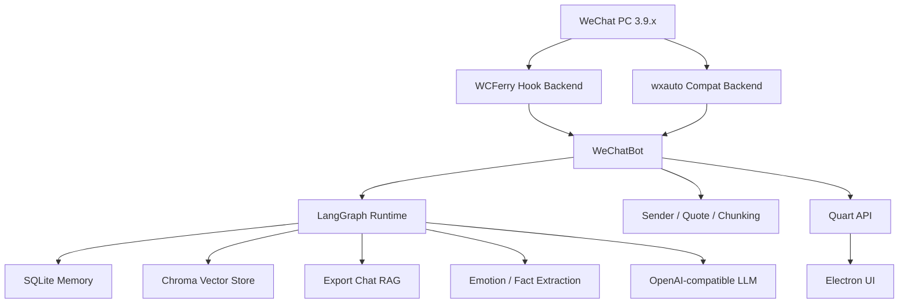

# WeChat Chat Bot

<div align="center">


基于 `WCFerry + wxauto(兼容模式) + Quart + Electron + LangChain/LangGraph` 的微信 AI 自动回复机器人。  
支持多 OpenAI-compatible 提供方、短期记忆、向量检索、导出语料 RAG、情绪分析、Prompt 个性化和桌面/Web 控制台。

</div>

## Quick Manual

第一次使用建议按下面顺序执行。详细说明已拆到独立文档。

1. [确认环境与限制](docs/USER_GUIDE.md#1-环境要求)
2. [安装后端依赖](docs/USER_GUIDE.md#2-安装依赖)
3. [安装桌面端依赖](docs/USER_GUIDE.md#2-安装依赖)
4. [配置模型与密钥](docs/USER_GUIDE.md#3-首次配置)
5. [执行环境自检](docs/USER_GUIDE.md#4-启动前检查)
6. [选择启动方式](docs/USER_GUIDE.md#5-启动方式)
7. [验证机器人是否工作](docs/USER_GUIDE.md#6-验证是否正常工作)
8. [启用 LangChain Runtime / RAG](docs/USER_GUIDE.md#7-langchain--rag-配置)
9. [排查常见问题](docs/USER_GUIDE.md#9-常见问题)

## Documentation

- [项目亮点与 LangChain 链路](docs/HIGHLIGHTS.md)
- [详细使用手册](docs/USER_GUIDE.md)
- [配置说明与优先级](docs/USER_GUIDE.md#8-配置说明)
- [常见问题排查](docs/USER_GUIDE.md#9-常见问题)
- [开发与测试](docs/USER_GUIDE.md#10-开发与测试)

## Features

- `Multi-provider`: 支持 OpenAI、DeepSeek、Qwen、Doubao、Ollama、OpenRouter、Groq 等 OpenAI-compatible 接口
- `LangGraph Runtime`: 用 LangChain/LangGraph 编排上下文加载、RAG、情绪分析、提示词构建、流式回复和后台事实提取
- `Memory`: SQLite 持久化短期记忆、用户画像、上下文事实和情绪历史
- `RAG`: 支持运行期对话向量记忆和导出聊天记录风格召回
- `Desktop + Web`: Electron 桌面客户端与 Quart Web API 并存
- `Hot Reload`: 支持配置热重载和运行时切换激活模型预设

## Architecture



核心路径：

- `backend/bot.py`: 机器人生命周期、消息入口和发送出口
- `backend/core/agent_runtime.py`: LangChain/LangGraph 主运行时
- `backend/core/memory.py`: SQLite 记忆层
- `backend/core/vector_memory.py`: Chroma 向量层
- `backend/api.py`: Web API
- `src/renderer/`: Electron 前端

## Requirements

- Windows 10 / 11
- WeChat PC `3.9.x`
- Python `3.9+`
- Node.js `16+`

静默模式说明：
- 默认后端是 `hook_wcferry`，目标是后台收发时不抢焦点、不抢键鼠。
- 当前默认要求微信版本为 `3.9.12.17`；如果本机不是该版本，静默模式会拒绝启动。
https://github.com/tom-snow/wechat-windows-versions/releases/tag/v3.9.12.17
- 如需继续使用旧版 UI 自动化链路，必须显式开启 `bot.compat_ui_enabled=true` 并切换 `bot.transport_backend=compat_ui`。这会重新带来焦点干扰风险。
- `voice_to_text` 在静默模式下改为走 OpenAI-compatible `/audio/transcriptions` 接口，需配置可用的 `bot.voice_transcription_model`。

限制：

- 不支持微信 `4.x`
- 不支持 Linux / macOS 直接运行微信自动化
- 运行期间需要保持微信客户端已登录且可被自动化访问

## Quick Start

```bash
git clone https://github.com/byteD-x/wechat-bot.git
cd wechat-bot
pip install -r requirements.txt
npm install
python run.py check
npm run dev
```

然后在桌面设置页中：

1. 选择模型预设
2. 填写 API Key
3. 测试连接
4. 保存配置
5. 启动机器人

完整配置流程见 [详细使用手册](docs/USER_GUIDE.md#3-首次配置)。

## Run Modes

### Desktop Mode

```bash
npm run dev
```

适合通过 GUI 配置和观察运行状态。

### Headless Bot

```bash
python run.py start
```

适合已经完成配置后直接运行机器人主循环。

### Web API

```bash
python run.py web
```

适合单独运行后端控制接口或与外部工具集成。

## Configuration

主要配置分区：

- `api`: 模型、Base URL、API Key、模型预设、超时、重试、embedding 模型
- `bot`: 回复策略、轮询、记忆、RAG、群聊规则、情绪识别
- `agent`: LangChain / LangGraph 运行时、检索参数、流式与 LangSmith 配置
- `logging`: 日志级别、文件、轮转和内容开关

详细字段说明、覆盖优先级和修改方式见 [配置说明](docs/USER_GUIDE.md#8-配置说明)。

## Development

```bash
# 安装依赖
pip install -r requirements.txt
npm install

# 开发启动
npm run dev

# 启动机器人
python run.py start

# 启动 Web API
python run.py web

# 环境检查
python run.py check
```

测试入口见 [开发与测试](docs/USER_GUIDE.md#10-开发与测试)。

## Security

以下内容默认视为敏感数据：

- `API Key`
- `data/` 下的密钥与覆写配置
- `data/chat_exports/`
- `data/logs/`
- 解密后的微信数据库

不要提交真实密钥、聊天导出和完整日志。

## License

MIT
