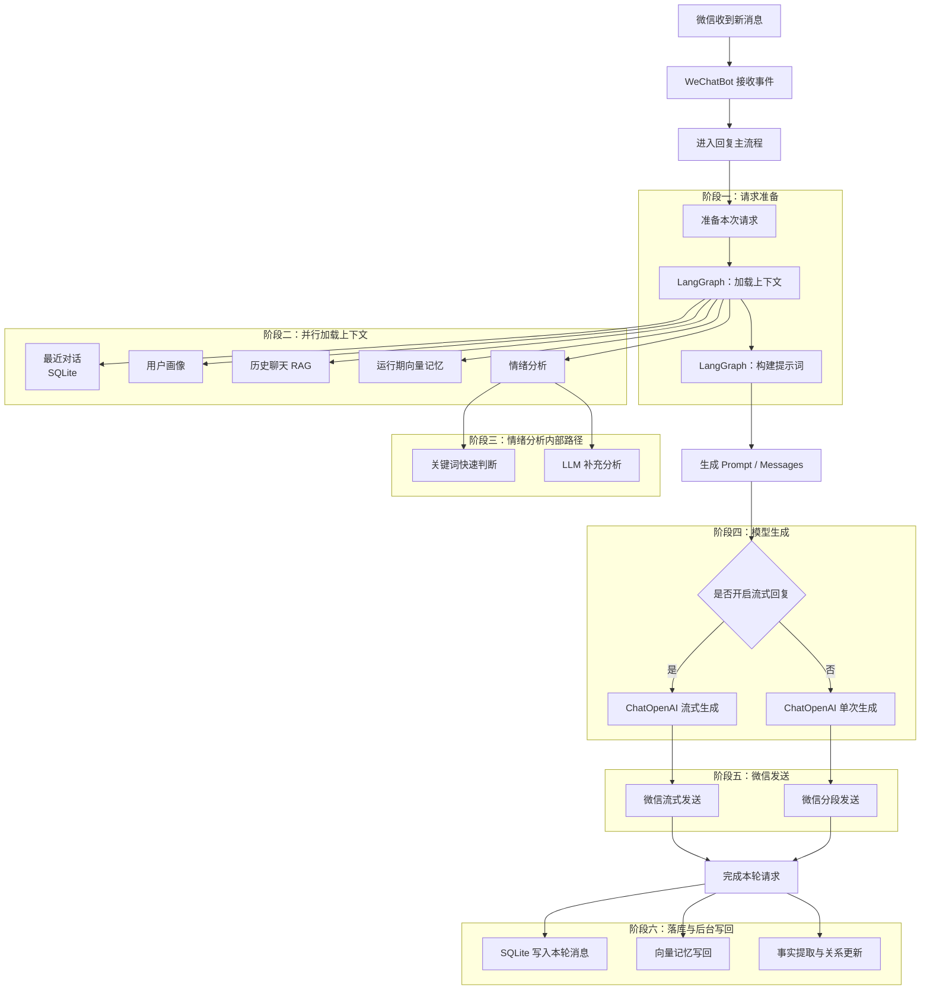

# 项目亮点

这份文档用于集中展示当前项目的技术亮点，以及已经落地的 LangChain/LangGraph 主链路。

## 1. 当前阶段的核心亮点

### 1.1 微信自动化 + 现代 AI 编排

项目不是简单地“收到消息后直接请求模型”，而是把微信自动化、上下文记忆、RAG、情绪分析、事实提取、流式输出整合成一条统一运行链。

核心特征：

- 微信消息入口基于 `wxauto`
- Web 控制面基于 `Quart`
- 桌面控制台基于 `Electron`
- AI 编排主链路基于 `LangChain + LangGraph`

### 1.2 多模型提供方统一接入

当前运行时并不绑定单一厂商，而是统一支持 OpenAI-compatible 提供方：

- OpenAI
- DeepSeek
- Qwen
- Doubao
- Ollama
- OpenRouter
- Groq
- 其他兼容 OpenAI 协议的服务

这意味着项目在保留供应商灵活性的同时，仍然可以复用统一的提示词、RAG 和运行时编排。

### 1.3 记忆系统不是单层，而是分层设计

项目当前已经形成了三层记忆：

1. 短期记忆：SQLite 最近对话上下文
2. 运行期向量记忆：当前聊天的语义召回
3. 导出语料 RAG：历史真实聊天风格召回

这三层分别服务于：

- 最近上下文连续性
- 语义补全
- 风格模仿

### 1.4 LangChain 集成不是 SDK 替换，而是运行时重构

这次集成不是把 HTTP 请求改成 `ChatOpenAI()` 就结束，而是把主处理流程拆成：

- 可编排的上下文准备图
- 可复用的模型与 embedding 适配
- 可流式输出的回复生成
- 可后台执行的事实提取和向量写回
- 可观测的 runtime 指标与 LangSmith tracing

### 1.5 面向性能的实现细节已经落地

当前链路已经包含这些性能优化点：

- Chat 会话级锁，避免同一会话并发写乱上下文
- Embedding 请求缓存与 pending 去重
- 上下文加载阶段并发执行短期记忆 / RAG / 情绪分析
- 非关键后台任务异步化，不阻塞首响应
- 流式输出支持首段优先发送，改善体感延迟

## 2. 当前 LangChain / LangGraph 链路

## 2.1 总体链路图

先看主干，再看每个阶段里的并行任务。整条链路可以概括为：`消息进入 -> 上下文准备 -> 提示构建 -> 模型生成 -> 微信发送 -> 落库与后台写回`。

## 2.2 实际节点与职责

当前代码路径：[`backend/core/agent_runtime.py`](/home/best/project/wechat-chat/backend/core/agent_runtime.py)

### 节点 1：`load_context`

入口方法：

- `AgentRuntime._load_context_node()`

职责：

- 读取 SQLite 最近上下文
- 读取用户画像
- 触发消息计数增长
- 召回导出语料 RAG
- 召回运行期向量记忆
- 分析情绪

并发行为：

- 上述任务通过 `asyncio.create_task()` 并发执行
- 失败时按模块降级，不阻塞主回复

### 节点 2：`build_prompt`

入口方法：

- `AgentRuntime._build_prompt_node()`

职责：

- 调用 `resolve_system_prompt()`
- 合并系统提示、画像、情绪、RAG 结果、历史上下文
- 构建 LangChain message 列表
- 支持图片消息转 `image_url` 内容块

### 节点 3：模型调用

非流式：

- `AgentRuntime.invoke()`
- 基于 `ChatOpenAI.ainvoke()`

流式：

- `AgentRuntime.stream_reply()`
- 基于 `ChatOpenAI.astream()`

特点：

- 模型实例支持 `base_url`，因此兼容 OpenAI-compatible 服务
- `max_tokens`、`max_completion_tokens`、`reasoning_effort` 都纳入运行时参数

### 节点 4：回复发送

入口代码：

- [`backend/bot.py`](/home/best/project/wechat-chat/backend/bot.py)

路径：

- 非流式：`_send_smart_reply()`
- 流式：`_stream_smart_reply()`

职责：

- 引用回复
- 分片发送
- 自然分段
- emoji 清洗
- 回复后缀拼装

### 节点 5：`finalize_request`

入口方法：

- `AgentRuntime.finalize_request()`

职责：

- 将本轮 user / assistant 消息写回 SQLite
- 写入情绪状态
- 异步写回向量记忆
- 异步做事实提取和关系更新

## 2.3 当前链路中的 LangChain 角色

当前项目里，LangChain 不是“外面包一层”，而是承担这些角色：

- `ChatOpenAI`: 统一模型调用入口
- `OpenAIEmbeddings`: 统一 embedding 入口
- `Messages`: 统一 prompt message 结构
- `LangGraph StateGraph`: 统一上下文准备阶段的编排容器
- `LangSmith`: 可选 tracing 与链路观测

## 2.4 当前链路中的 LangGraph 范围

当前已经接入 `StateGraph`，但不是把所有行为都硬塞进图里。

图内：

- `load_context`
- `build_prompt`

图外但受 runtime 管理：

- `invoke / astream`
- `finalize_request`
- 后台向量写回
- 后台事实提取

这样做的原因是：

- 保留图编排的清晰边界
- 避免把发送层和副作用层过度耦合到图里
- 让回复路径更容易做性能优化和故障隔离

## 3. 当前链路的并发与性能设计

## 3.1 首响应优先

当前设计目标不是追求“最复杂的 agent”，而是优先缩短用户体感延迟。

做法：

- `load_context` 阶段并发取记忆、RAG、情绪
- 流式回复优先发送首批 chunk
- 事实提取和向量写回放到后台

## 3.2 Embedding 缓存

入口方法：

- `AgentRuntime.get_embedding()`

当前实现：

- 内存 TTL 缓存
- 相同文本 pending 去重
- 避免同一输入重复请求 embedding

## 3.3 失败降级

当前链路不是单点失败即整体失败。

降级策略：

- 导出语料 RAG 失败：忽略该部分上下文
- 运行期向量检索失败：忽略该部分上下文
- 情绪分析失败：退回关键词分析或无情绪注入
- LangSmith 失败：不影响主回复

## 4. 当前实现的代码映射

关键文件：

- [`backend/core/agent_runtime.py`](/home/best/project/wechat-chat/backend/core/agent_runtime.py)
- [`backend/bot.py`](/home/best/project/wechat-chat/backend/bot.py)
- [`backend/core/factory.py`](/home/best/project/wechat-chat/backend/core/factory.py)
- [`backend/core/memory.py`](/home/best/project/wechat-chat/backend/core/memory.py)
- [`backend/core/vector_memory.py`](/home/best/project/wechat-chat/backend/core/vector_memory.py)
- [`backend/core/export_rag.py`](/home/best/project/wechat-chat/backend/core/export_rag.py)

## 5. 对外展示时可强调的点

如果要对外介绍这个项目，当前最值得强调的是：

- 不是普通的微信自动回复，而是有完整记忆与 RAG 分层的本地 agent
- 不是绑定单模型厂商，而是兼容 OpenAI-compatible 生态
- 不是只接 LangChain SDK，而是把 LangGraph 真正放进主运行时
- 不是只会“回答”，还会做情绪识别、事实提取和关系演进
- 不是纯命令行工具，而是具备 Electron + Web 双控制面
